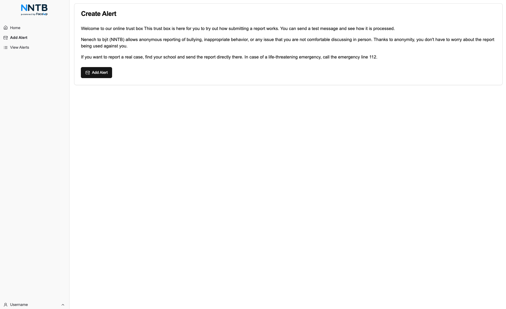
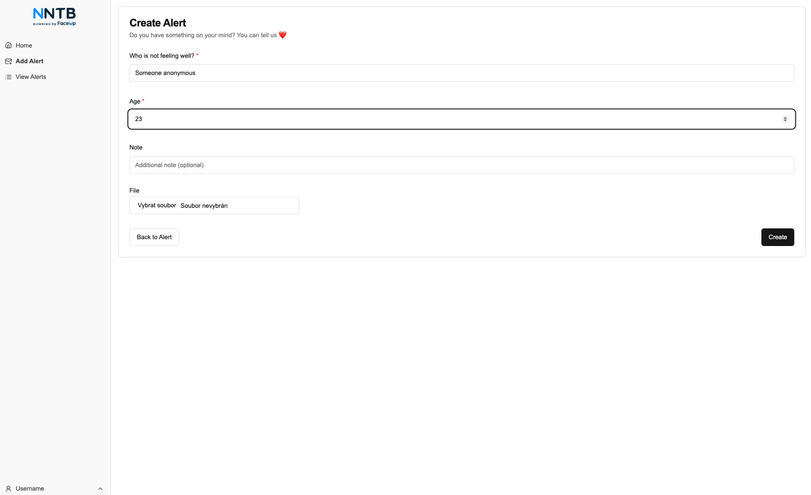
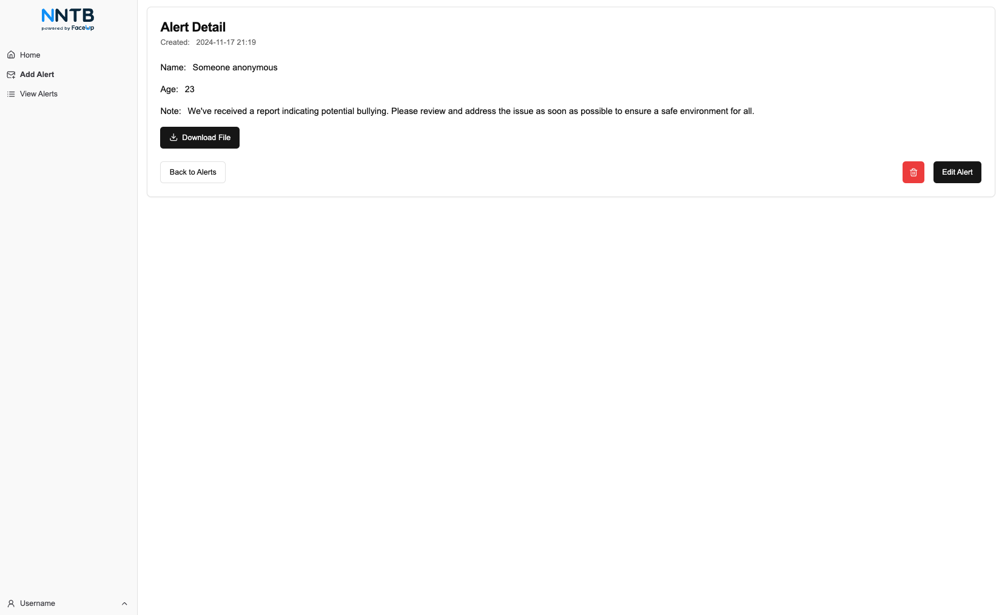
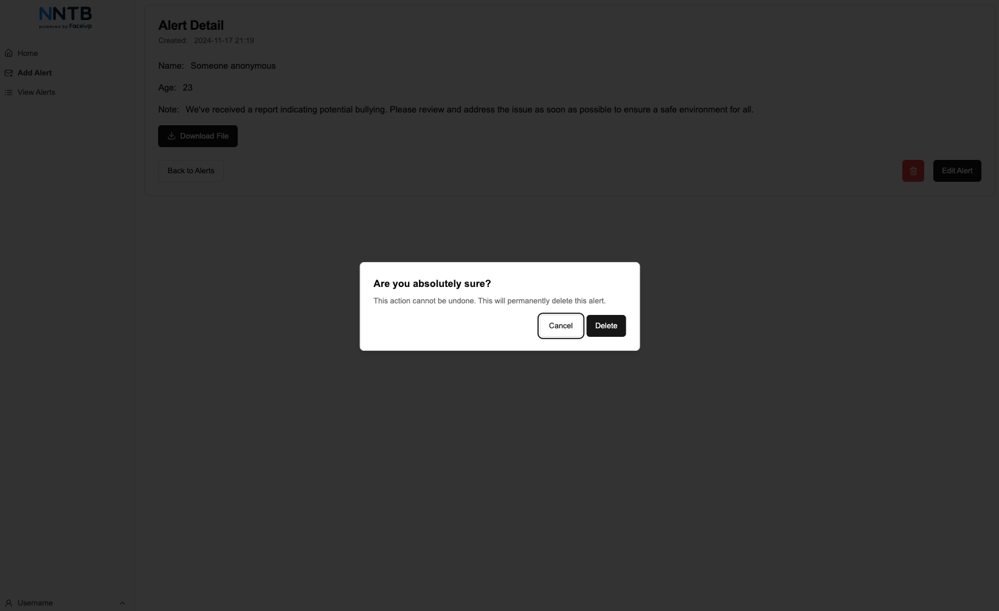
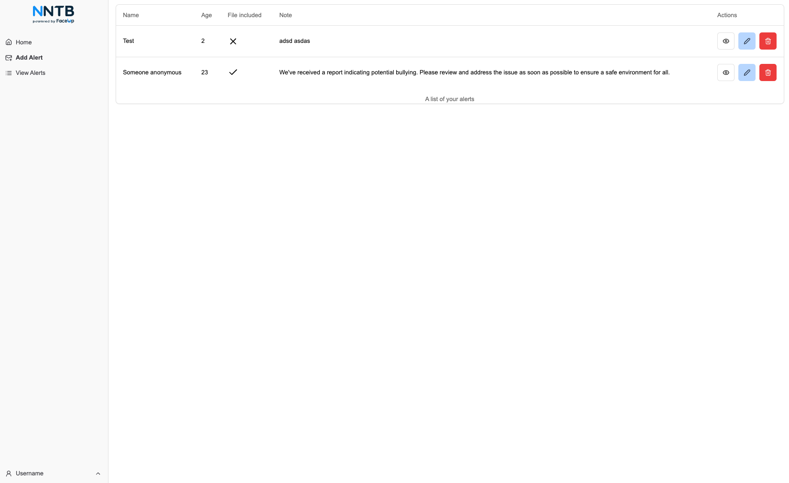

# Dokumentace aplikace

Tato dokumentace popisuje celkovou architekturu, funkčnost a implementaci aplikace. Aplikace se skládá z backendové a frontendové části, přičemž každá z těchto částí má specifické funkce a technologie. Tato souhrnná dokumentace poskytuje přehled a zároveň odkazuje na podrobnější dokumentaci jednotlivých částí backendu a frontendu.

[Zadání](./Assignment.md)

## Obsah

1. [Architektura aplikace](#architektura-aplikace)
2. [Technologie](#technologie)
3. [Hlavní funkce](#hlavní-funkce)
4. [Backend dokumentace](./backend_documentation.md)
5. [Frontend dokumentace](./frontend_documentation.md)
6. [Nedokončené a budoucí funkce](#nedokončené-a-budoucí-funkce)
7. [Ukázka aplikace](#ukázka-aplikace)

## Architektura aplikace

Aplikace se skládá ze dvou hlavních částí:

- **Backend**: Serverová část poskytující API, spravující data a komunikující s databází.
- **Frontend**: Uživatelské rozhraní, které komunikuje s backendem a poskytuje uživatelům přístup k funkcím aplikace.

Backend i frontend jsou navrženy jako samostatné aplikace, které spolu komunikují prostřednictvím REST API.

## Technologie

Aplikace využívá moderní technologie pro zajištění vysoké spolehlivosti, výkonu a rozšiřitelnosti:

- **Backend**: Postavený na frameworku NestJS, používá PostgreSQL databázi a Prisma ORM pro správu dat.
- **Frontend**: Postavený na Next.js pro jednoduchý a rychlý vývoj uživatelského rozhraní, využívá knihovnu shadcn UI pro komponenty a interakce.

## Hlavní funkce

- **Vytvoření upozornění**: Uživatel může vytvářet upozornění kterým chce něco nahlásit.
- **Upload souborů**: Každé upozornění může obsahovat soubor, který lze nahrát a později stáhnout.
- **Správa upozorněné**: Umožňuje uživatelům procházet jejich upozornění a následně je editovat či mazat.

## Další části dokumentace

- [Backend dokumentace](./backend/README.md): Podrobná dokumentace týkající se backendu, včetně architektury, API endpointů a detailů o databázové struktuře.
- [Frontend dokumentace](./frontend/README.md): Podrobná dokumentace k frontendové části, včetně komponent, stránek a komunikace s backendem.

## Nedokončené a budoucí funkce

### Nedokončené funkce

- **Testování aplikace**: Je potřeba dodělat testy jak pro backend tak pro frontend

- **Přidání kategorií**: Mít možnost volit kategorii při zakládání upozornění

- **Detailní logování akcí uživatelů**: Pro lepší sledování aktivit uživatelů by bylo vhodné implementovat systém logování, který zaznamenává všechny klíčové akce provedené uživateli.

- **Role a oprávnění**: Aktuálně všichni uživatelé mají stejné oprávnění. Bylo by dobré implementovat různé role (např. administrátor, editor, běžný uživatel) a k nim odpovídající oprávnění.

- **Pokročilé notifikace**: Mělo by být možné nastavit různé typy notifikací, jako jsou e-mailové nebo push notifikace.

### Budoucí funkce a nápady na rozšiřování

- **Integrace se službami třetích stran**: Integrace s dalšími službami, jako jsou Slack nebo Microsoft Teams, by mohla zlepšit komunikaci a notifikace pro firmy a školy.

- **Možnost skupinového hlášení**: Implementace funkce, která by umožňovala více uživatelům sdílet jedno upozornění, by mohla být užitečná pro skupinové aktivity nebo řešení společných problémů.

- **Rozšířená analýza dat**: Přidání analytických nástrojů pro sledování trendů ve vytváření upozornění, což by mohlo pomoci správcům lépe pochopit problémy, které se vyskytují.

- **Podpora více jazyků**: Přidání podpory pro více jazyků, aby aplikace mohla být používána v různých zemích a pro různé jazykové skupiny.

- **Automatizované reporty**: Generování automatizovaných reportů, které budou zasílány na e-mail administrátorům, aby měli přehled o aktivitě v systému.

## Ukázka aplikace

### Úvodní stránka

### Vytvoření upozornění

### Detail upozornění

### Smazat upozornění

### Seznam upozornění

